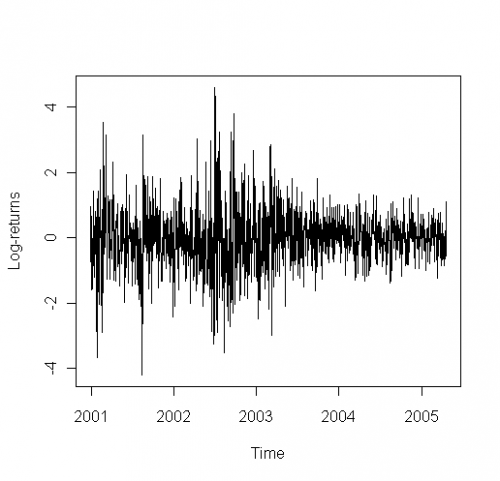

[](http://quantlet.de/index.php?p=info)

## [](http://quantlet.de/) **STF2tvch01** [](http://quantlet.de/d3/ia)

```yaml

Name of QuantLet : STF2tvch01

Published in : Statistical Tools for Finance and Insurance

Description : Plots the daily log-returns of S&P 500 in the years 2001 to 2005.

Keywords : returns, time-series, garch, nonstationary, heteroskedasticity

See also : STF2tvch02, STF2tvch03, STF2tvch04, STF2tvch05, STF2tvch06, STF2tvch07

Author : Pavel Cizek, Wolfgang K. Haerdle, Rafal Weron

Submitted : Thu, October 06 2011 by Awdesch Melzer

Datafile : SP1997-2005s.txt

Example : Plot of the daily log-returns of S&P 500 2001-2005

```




### R Code:
```r
# Clear variables and close windows
rm(list = ls(all = TRUE))
graphics.off()

# Please change working directory setwd('C:/...')

data <- read.delim2("SP1997-2005s.txt")

time <- (1:length(data[, 1]))
dat0 <- data[, 1] - c(mean(data[, 1]))
dat0 <- dat0/sd(dat0)

timet <- (time - 1078)/250 + 2001
plot(timet[time >= 1075], dat0[time >= 1075], xaxp = c(2001, 2005, 4), xlab = "Time", ylab = "Log-returns", type = "l") 

```
