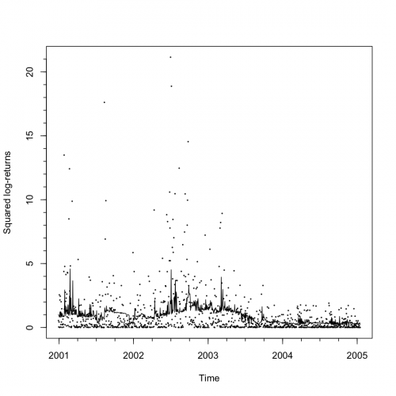
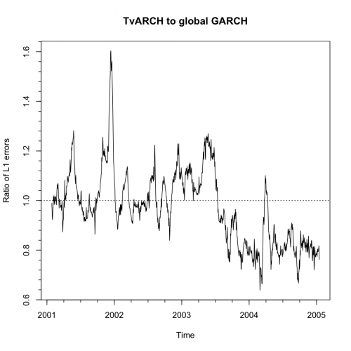

[](http://quantlet.de/)

## [](http://quantlet.de/) **STF2tvch04** [](http://quantlet.de/)

```yaml

Name of QuantLet : STF2tvch04

Published in : Statistical Tools for Finance and Insurance

Description : 'Plots the estimation output of the tvARCH(1) model for SP500 data including the
predicted volatilities and forecasting errors relative to GARCH; the numerical values of mean
absolute errors are also provided. For faster, but less precise computation, the bandwidth can be
set to a fixed value at the end of the for loop.'

Keywords : 'arch, garch, returns, time-series, nonstationary, heteroskedasticity, forecast,
volatility'

See also : STF2tvch01, STF2tvch02, STF2tvch03, STF2tvch05, STF2tvch06, STF2tvch07

Author : Pavel Cizek

Submitted : Thu, October 06 2011 by Awdesch Melzer

Datafile : SP1997-2005s.txt

Example : 'Plot of the estimation output of the tvARCH(1) model for SP500 data including the
predicted volatilities and plot of TvARCH forecasting errors relative to global GARCH.'

```






### R Code:
```r
# Remove variables and close windows
rm(list = ls(all = TRUE))
graphics.off()

# Load library install.packages(c('aws', 'fGarch', 'igraph', 'Hmisc')) install.packages('igraph')
library(igraph)
library("fGarch")
library("igraph")
library("stats")
library("Hmisc")


# Kernel-NLS tvArch estimate
tvarch <- function(p, X, t0, bn, lou = FALSE) {
    n <- length(X)
    if (bn < 1) 
        bn <- bn * n
    t0 <- min(max(bn + 1, t0), n - bn)
    if (lou) 
        wint <- c((t0 - bn):(t0 - 1), (t0 + 1):(t0 + bn)) else wint <- ((t0 - bn):(t0 + bn))
    
    if (p == 0) 
        return(list(coefs = mean(X[wint]^2), pred = mean(X[wint]^2)))
    
    matX <- 1
    for (s in (1:p)) matX <- cbind(matX, c(double(p), X[(p - s + 1):(n - s)]^2))
    mut <- sum(X[wint]^2)/bn
    stdk <- c(double(p - 1), running.mean(X^2, p))
    
    matXX <- t(matX[wint - 1, ]) %*% (matX[wint - 1, ]/(mut + stdk[wint - 1])^2)/bn
    vecXX <- t(matX[wint - 1, ]) %*% (X[wint]^2/(mut + stdk[wint - 1])^2)/bn
    at0 <- solve(matXX) %*% vecXX
    
    if (lou) 
        pred <- sum(at0 * matX[t0 - 1, ]) else pred <- sum(at0 * matX[n, ])
    
    return(list(coefs = at0, pred = pred))
    
}

# bandwidth choice of tvARCH
tvband <- function(p, X, per, pow = 2) {
    bn <- c(seq(5 * (p + 1), 40, 5), seq(50, 100 + p * 30, 10))
    cv <- double(length(bn))
    for (i in 1:length(bn)) {
        band <- bn[i]
        for (t0 in (length(X) - per):length(X)) {
            res <- tvarch(p, X[1:(t0 - 1)], t0, band)
            cv[i] <- cv[i] + (abs(X[t0]^2 - res$pred))^pow
        }
    }
    
    return(bn[which.min(cv)])
}

data <- read.delim2("SP1997-2005s.txt")


time <- (1:length(data[, 1]))
dat0 <- data[, 1] - c(mean(data[, 1]))
dat0 <- dat0/sd(dat0)

pred <- 0 * time - 1
bands <- 0 * time - 1
p <- 1
h <- 1
coefs <- matrix(0, NROW(pred), p + 1)
esterr <- pred
ggarch <- pred


band <- 0
ghist <- 250
sper <- 70
for (i in 1076:2088) {
    if (band == 0) 
        band <- tvband(p, dat0[(i - 500 - p * 60 - 66):(i - 1)], 66, pow = 1)
    print(c(i, band))
    bands[i] <- band
    res <- tvarch(p, dat0[(i - 500 - p * 60):(i - 1)], i, band)
    pred[i] <- res$pred
    coefs[i, ] <- res$coefs
    esterr[i] <- sum(abs(pred[i] - dat0[i:(i + h - 1)]^2))
    
    gest <- garchFit(~garch(1, 1), data = dat0[1:(i - 1)], trace = FALSE, include.mean = FALSE)
    ggarch[i] <- sum(abs(predict(gest, n.ahead = h)$standardDeviation^2 - dat0[i:(i + h - 1)]^2))
    
    # set a fixed bandwidth (in days)?
    band <- 0
}
lc <- (pred)
timet <- (time - 1078)/250 + 2001
dev.new()
plot(timet[pred >= 0], dat0[pred >= 0]^2, cex = 0.2, xaxp = c(2001, 2005, 4), xlab = "Time", ylab = "Squared log-returns")
lines(timet[pred >= 0], pred[pred >= 0])
minor.tick(4, 5)
readline("Save the plot...")

lc <- lc[1:sum(pred >= 0)]
time <- time[1:sum(pred >= 0)]

timet <- timet[pred >= 0]
errs <- esterr[pred >= 0]
ggarch <- ggarch[pred >= 0]
pred <- pred[pred >= 0]

lags <- 21
dev.new()
plot(timet[lags:length(time)], running.mean(errs, lags)/running.mean(ggarch, lags), type = "l", xlab = "Time", ylab = "Ratio of L1 errors", 
    main = "TvARCH to global GARCH", xaxp = c(2001, 2005, 4))
abline(1, 0, lty = "dotted")
minor.tick(4, 5)
readline("Save the plot...")

print("Mean absolute forecast errors of tvARCH and GARCH:")

print("By year:")
for (ye in 1:4) print(c(mean(errs[(250 * (ye - 1) + 1):(250 * ye)]), mean(ggarch[(250 * (ye - 1) + 1):(250 * ye)])))
print("Total:")
print(c(mean(errs[1:1000]), mean(ggarch[1:1000]))) 

```
