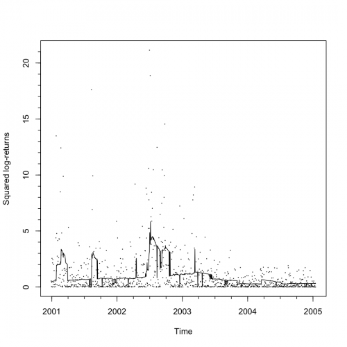

[](http://quantlet.de/index.php?p=info)

## [](http://quantlet.de/) **STF2tvch07** [](http://quantlet.de/d3/ia)

```yaml

Name of QuantLet : STF2tvch07

Published in : Statistical Tools for Finance and Insurance

Description : 'Evaluates the mean absolute forecast errors of the AWS model for SP500 data in years
2001--2005 and plots the forecasted volatility.'

Keywords : arch, forecast, garch, time-series, volatility

See also : STF2tvch01, STF2tvch02, STF2tvch03, STF2tvch04, STF2tvch05, STF2tvch06

Author : Pavel Cizek

Submitted : Fri, October 07 2011 by Awdesch Melzer

Datafile : SP1997-2005s.txt

Example : Plot of mean absolute forecast errors in the AWS model for SP500 data.

```




### R Code:
```r
# load library install.packages(c('aws', 'fGarch', 'igraph', 'Hmisc'))
library("aws")
library("fGarch")
library("igraph")
library("Hmisc")

# Clear variables and close windows
rm(list = ls(all = TRUE))
graphics.off()

# Please change working directory
setwd("C:/...")
data <- read.delim2("SP1997-2005s.txt")

time <- (1:length(data[, 1]))
res <- aws(data[, 1], family = "Gaussian")
dat0 <- data[, 1] - c(mean(data[, 1]))
dat0 <- dat0/sd(dat0)

ladj <- 0.16

p <- 1
n <- length(dat0)
matX <- NULL
for (s in (1:p)) matX <- cbind(matX, c(double(p), dat0[(p - s + 1):(n - s)]^2))

pred <- 0 * time - 1
esterr <- pred
ggarch <- pred
h <- 1

for (i in 1076:2088) {
    print(i)
    res <- aws(dat0[(i - 500):(i - 1)], family = "Volatility", ladjust = ladj, demo = FALSE)
    awspred <- awsdata(res, "theta")
    pred[i] <- awspred[length(awspred)]
    esterr[i] <- sum(abs(pred[i] - dat0[i:(i + h - 1)]^2))
    
    gest <- garchFit(~garch(1, 1), data = dat0[1:(i - 1)], trace = FALSE, include.mean = FALSE)
    ggarch[i] <- sum(abs(predict(gest, n.ahead = h)$standardDeviation^2 - dat0[i:(i + h - 1)]^2))
    
    print(c(pred[i], dat0[i:(i + h - 1)]^2, esterr[i], ggarch[i], awspred[length(awspred), ]))
}
lc <- pred
timet <- (time - 1078)/250 + 2001
plot(timet[pred >= 0], dat0[pred >= 0]^2, cex = 0.1, xaxp = c(2001, 2005, 4), xlab = "Time", ylab = "Squared log-returns")
lines(timet[pred >= 0], pred[pred >= 0])
minor.tick(4, 5)

lc <- lc[1:sum(pred >= 0)]
time <- time[1:sum(pred >= 0)]

timet <- timet[pred >= 0]
errs <- esterr[pred >= 0]
ggarch <- ggarch[pred >= 0]
pred <- pred[pred >= 0]

print("Mean absolute forecast errors of AWS and GARCH:")

print("By year:")
for (ye in 1:4) print(c(mean(errs[(250 * (ye - 1) + 1):(250 * ye)]), mean(ggarch[(250 * (ye - 1) + 1):(250 * ye)])))
print("Total:")
print(c(mean(errs[1:1000]), mean(ggarch[1:1000]))) 

```
