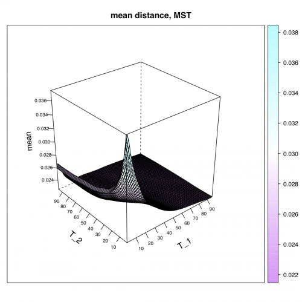
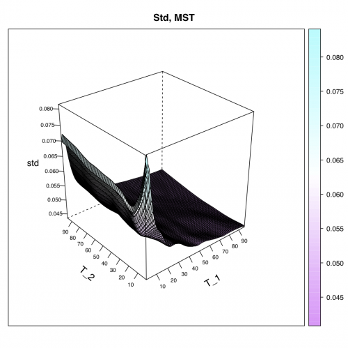
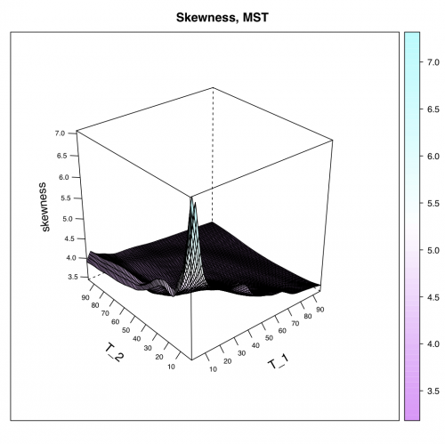
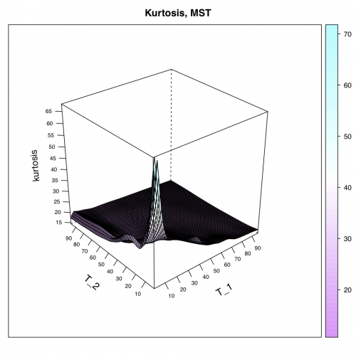
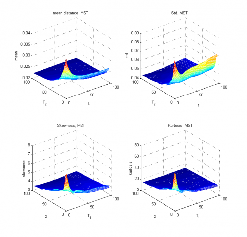

[](http://quantlet.de/)

## [](http://quantlet.de/) **STFdmm12** [](http://quantlet.de/)

```yaml

Name of QuantLet : STFdmm12

Published in : Statistical Tools for Finance and Insurance

Description : 'Presents the statistical properties of the minimum spanning tree as a function of
time windows sizes for elements of the chosen WIG 20 companies (close.csv). The Theil index based
distance is used. Requires theil.m, mst.m, manh.m to run the program. Note that the {statistical
toolbox} from Matlab is required as well.'

Keywords : financial, distance, tree, portfolio, asset, visualization, descriptive-statistics

See also : manh, mst, theil

Author : Janusz Miskiewicz, Awdesch Melzer

Submitted : Mon, November 26 2012 by Dedy Dwi Prastyo

Datafile : gwp.csv

Example : theil.m, mst.m, manh.m produce these plots.

```












### R Code:
```r
rm(list=ls(all=TRUE))
graphics.off()

install.packages("moments")
library(moments)


##########################################
########## Subroutine manh(x) ############
##########################################


manh = function(x){
# Manhattan distence between time series normalised by the time series
# length.
# x - time series
#
x      = as.matrix(x)
h      = nrow(x)
k      = ncol(x)
result = matrix(0,k,k)
for (j in 1:k){
  for (i in 1:k){
	result[i,j] = abs(mean(x[,i]-x[,j]))
  }
}
retval= result
return(retval)
}


###########################################
############ Subroutine mst(x) ############
###########################################


mst	= function(x){
# Algorithm generates minimum spanning tree
# The rsult is presentes as a set of links between nodes
	n		= nrow(x)
	m		= ncol(x)
	true	= upper.tri(x)
	x		= true*x
	net		= matrix(0,n-1,3)
	onnet	= rep(as.integer(0),n)
	klaster	= rep(as.integer(0),n)
	klast	= 0L
	licz	= 0L
	# check if the matrics is symmetric and positive
	maxx	= max(apply(x,2,max))
	smax	= 10*abs(maxx)
	x[x==0]	= smax
while (licz<n-1){

	minx	= min(apply(x,2,min))
	d		= which(x<=minx,arr.ind=T)
	i		= d[,1]
	j		= d[,2]
  if (length(i) > 1){
    ii		= i[1]
    jj		= j[1]
    i		= 0
    j		= 0
    i		= ii
    j		= jj
  }
  
  if (onnet[i] ==0 & onnet[j] ==0){
    licz		= licz+1L
    net[licz,1]	= i
    net[licz,2]	= j
    klast		= klast+1L
    klaster[i]	= klast
    klaster[j]	= klast
    net[licz,3]	= min(x[i,j],x[j,i])
    onnet[i]	= 1
    onnet[j]	= 1
    x[i,j]		= smax
    x[j,i]		= smax

  }else if (onnet[i]==0 & onnet[j]==1)  {
    licz = licz+1
    net[licz,1]	= i
    net[licz,2]	= j
    net[licz,3]	= min(x[i,j],x[j,i])
    onnet[i]	= 1
    klaster[i]	= klaster[j]
    x[i,j]		= smax
    x[j,i]		= smax
  }else if (onnet[i] ==1 & onnet[j] ==0)  {
    licz		= licz+1L
    net[licz,1]	= i
    net[licz,2]	= j
    net[licz,3]	= min(x[i,j],x[j,i])
    onnet[j]	= 1
    klaster[j]	= klaster[i]
    x[i,j]		= smax
    x[j,i]		= smax
  }else if (onnet[i] ==1 & onnet[j] ==1 & klaster[i]==klaster[j])  {
    x[i,j]		= smax
    x[j,i]		= smax
 } else if  (onnet[i] ==1 & onnet[j] ==1 & klaster[i]!=klaster[j]){
    licz 		= licz+1L
    net[licz,1]	= i
    net[licz,2]	= j
    net[licz,3]	= min(x[i,j],x[j,i])
    klaster[klaster==klaster[i]]=klaster[j]
  }
}
retval = net
return(retval) 
}

#############################################
############ Subroutine theil(x) ############
#############################################


theil = function(x,n){
# Converts the given time series into time series of Theil index
# n - size of moving window
# x - analysed time series
#
x         = as.matrix(x)
n_pocz    = nrow(x)
k         = ncol(x)

rozm      = n_pocz-n+1

retval    = matrix(0,rozm,k)
    for (i in 1:rozm){
    	sr          = apply(x[i:(i+n-1),],2,mean)
    	temp        = x[i:(i+n-1),]/(matrix(1,n,1)%*%sr)
    	temp        = temp*log(temp)
    	retval[i,]  = apply(temp,2,mean)
    }
return(retval)
}


###########################################
############ Main calculation #############
###########################################

data = read.table("gwp.csv",header=T)
data    = as.matrix(data)
data = abs(diff(log(data))) # abs log return

dl_szer = nrow(data)
podmioty= ncol(data)
data[data==0]      = 0.0000001


print("The procedure may last several hours since 9025 networks are constructed.")


# define matrices
        wynik_wind_mean = matrix(0,96,96)
        wynik_wind_std  = matrix(0,96,96)
        wynik_wind_skew = matrix(0,96,96)
        wynik_wind_kurt = matrix(0,96,96)


# time window loop
for (window1 in 5:100){
    theil_data  = theil(data,window1)
    for (window2 in 5:100){
    
# moving time window
        wynik   = numeric()
        for (t in 1:(dl_szer - window1-1-window2)){
            window_data = theil_data[t:(t+window2),]
            wind_dist   = manh(window_data)
            wind_mst    = mst(wind_dist)
            wynik       = c(wynik,wind_mst[,3])
            wind_mst    = numeric()
            wind_dist   = numeric()
        }
        wynik_wind_mean[window1-4,window2-4] = mean(wynik)
        wynik_wind_std[window1-4,window2-4]  = sd(wynik)
        wynik_wind_skew[window1-4,window2-4] = skewness(wynik)
        wynik_wind_kurt[window1-4,window2-4] = kurtosis(wynik)
    }
}


require(lattice)

wireframe(wynik_wind_mean,drape=T,#ticktype="detailed",
	main="mean distance, MST",
	scales=list(arrows=FALSE,col="black",distance=1,tick.number=8,cex=.7),
	xlab=list("T_1",rot=30,cex=1.2),
	ylab=list("T_2",rot=-40,cex=1.2),
	zlab=list("mean",rot=95,cex=1.1))
dev.new()

wireframe(wynik_wind_std,drape=T,#ticktype="detailed",
	main="Std, MST",
	scales=list(arrows=FALSE,col="black",distance=1,tick.number=8,cex=.7),
	xlab=list("T_1",rot=30,cex=1.2),
	ylab=list("T_2",rot=-40,cex=1.2),
	zlab=list("std",cex=1.1))
dev.new()

wireframe(wynik_wind_skew,drape=T,#ticktype="detailed",
	main="Skewness, MST",
	scales=list(arrows=FALSE,col="black",distance=1,tick.number=8,cex=.7),
	xlab=list("T_1",rot=30,cex=1.2),
	ylab=list("T_2",rot=-40,cex=1.2),
	zlab=list("skewness",rot=95,cex=1.1))

dev.new()
wireframe(wynik_wind_kurt,drape=T,#ticktype="detailed",
	main="Kurtosis, MST",
	scales=list(arrows=FALSE,col="black",distance=1,tick.number=8,cex=.7),
	xlab=list("T_1",rot=30,cex=1.2),
	ylab=list("T_2",rot=-40,cex=1.2),
	zlab=list("kurtosis",rot=95,cex=1.1))

```

### MATLAB Code:
```matlab
clear all
close all
clc

data = load('gwp.csv');
data = abs(diff(log(data))); % abs log return

[dl_szer,podmioty] = size(data);
data(data==0)      = 0.0000001;

% time window loop
disp('The procedure may last several hours since 9025 networks are constructed.')
for window1=5:100
    theil_data = theil(data,window1);
    for window2=5:100

% moving time window
        wynik = [];
        for t=1:(dl_szer - window1-1-window2)
            window_data = theil_data(t:(t+window2),:);
            wind_dist   = manh(window_data);
            wind_mst    = mst(wind_dist);
            wynik       = [wynik;wind_mst(:,3)];
            wind_mst    = [];
            wind_dist   = [];
        end;
        wynik_wind_mean(window1-4,window2-4) = mean(wynik);
        wynik_wind_std(window1-4,window2-4)  = std(wynik);
        wynik_wind_skew(window1-4,window2-4) = skewness(wynik);
        wynik_wind_kurt(window1-4,window2-4) = kurtosis(wynik);
    end;
end;

subplot(2,2,1), mesh(wynik_wind_mean,'DisplayName','mean distance, MST');figure(gcf)
xlabel('T_1');
ylabel('T_2');
zlabel('mean');
title('mean distance, MST');
subplot(2,2,2),mesh(wynik_wind_std,'DisplayName','Std, MST');figure(gcf) 
xlabel('T_1');
ylabel('T_2');
zlabel('std');
title('Std, MST');
subplot(2,2,3),mesh(wynik_wind_skew,'DisplayName','Skewness, MST');figure(gcf)
xlabel('T_1');
ylabel('T_2');
zlabel('skewness');
title('Skewness, MST');
subplot(2,2,4),mesh(wynik_wind_kurt,'DisplayName','Kurtosis, MST');figure(gcf)
xlabel('T_1');
ylabel('T_2');
zlabel('kurtosis');
title('Kurtosis, MST');
```
